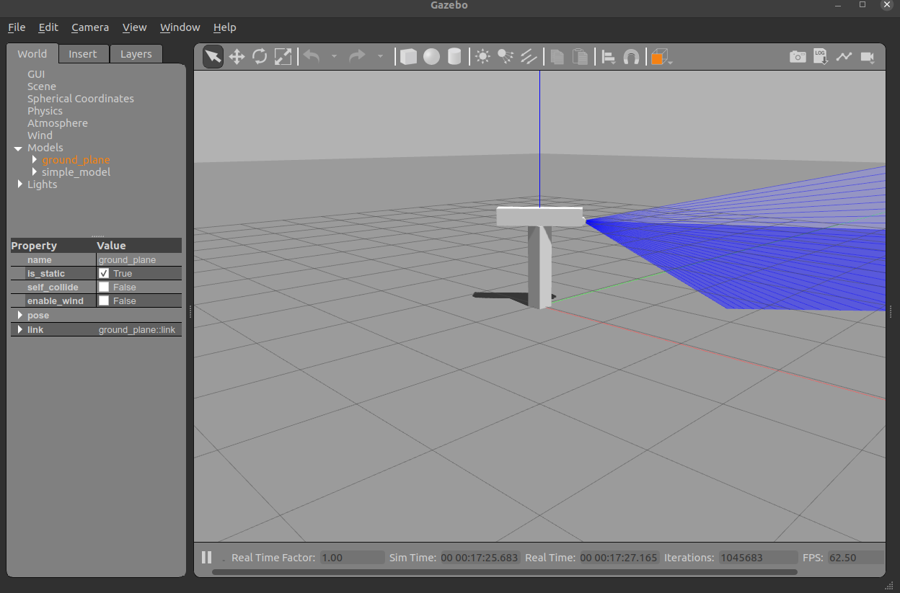

# RE510

# Title : usage of the Gazebo Simulator

## Make you own mobile robot

• It is an assignment that I want to help with your future research.
(Free Format: Bicycle, Tricycle, Car, or even if the four-legged robot)

• Create the model file / launch file

• Submit a compressed package and a short video of the screen, which must include a
gazebo window. Capturing rqt, rviz, and terminal window is an option.

• It doesn't matter to you submit the robot you made in class (you will only get basic scores)

• Explain the Xacro file or SDF file in the report and write why it is valid.
• If you copy someone else's, you’ll get zero points and punishment.

### class 1 - Build a simple machine by URDF

make a simple lidar with T shaped machine

</img>