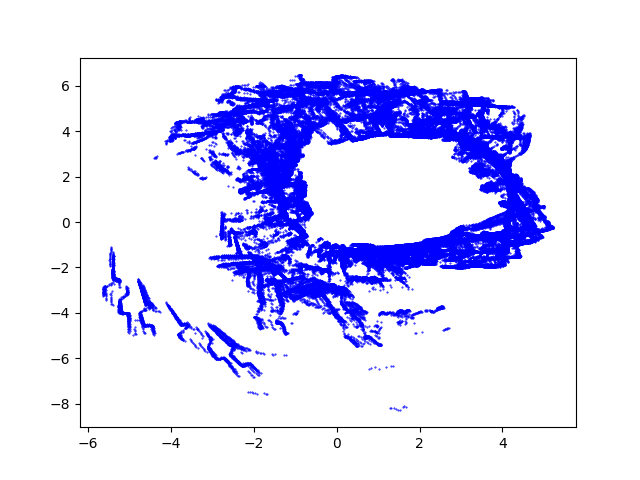
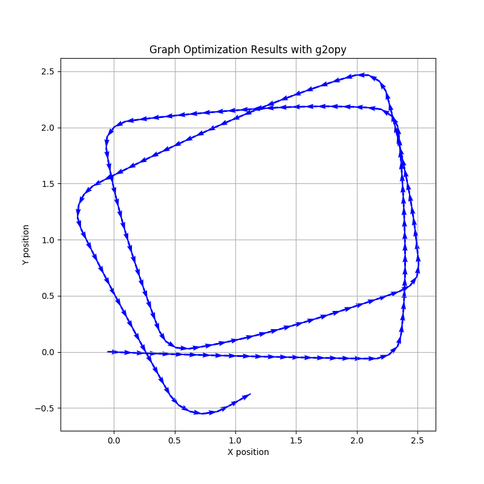
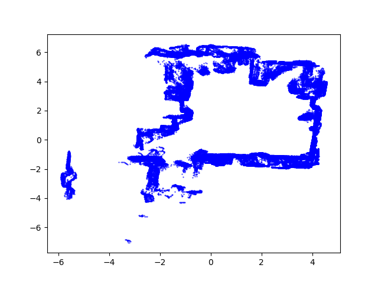
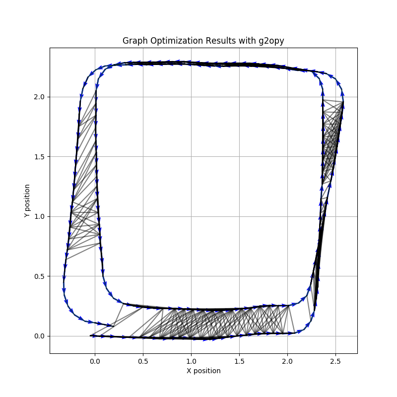

# RE510

# Title : Graph-Based SLAM

## Assignment

### Assignment 1 : Node generation

- Calculate pose difference using odometry.

- In certain interval, generate node (odometry+LiDAR)

### Assignment 2 : Add odometry vertex & edge

- Add vertex and edge of odometry information

### Assignment 3 : Find loop closure

- Find loop closure (matching pair)

- Pair can be near nodes. (in certain distance threshold)

- Or just simply, try to match all pairs ([1,2], [1,3], [1,4], [1,5], [2,3], [2,4], …)

### Assignment 4 : ICP matching, Add edge and Optimize

- Add edge using ICP constraint

  - If ICP matching is correct ( can determine using distances between corresponding points.)

  - Add edge to graph structure for optimization.

  - How can you put constraint pose? (calculate using initial guess and ICP result)

### Additional notes

- Loop closure score

  - Brute force(all pair) : 5 / 10

  - Find near node in odom : 8 / 10

  - Merge assign 3,4 : 10 / 10

- Information matrix score

  - Identity matrix \* constant: 3/5

  - Related to odometry difference : 5/5

    (ex: If robot rotate, large yaw covariance, robot go forward, large x covariance and etc.)

## Example Plot result

Matplotlib

</img>
</img>

G2O viewer

</img>
</img>
